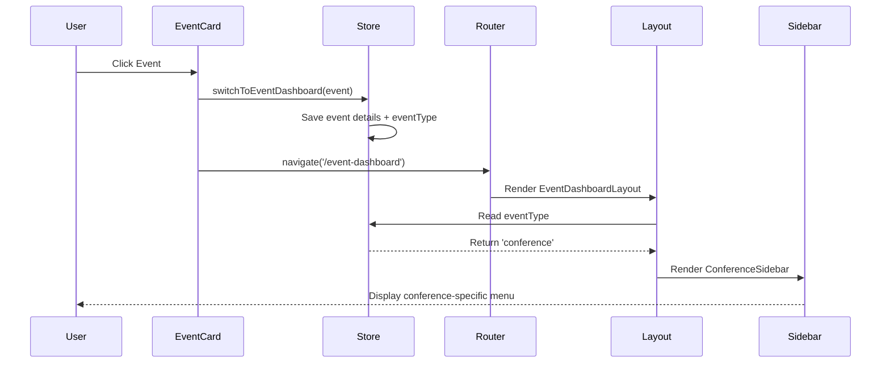

# Store Integration Summary

## Completed Integrations

### 1. Organization Dashboard - Recent Events
**File:** [`src/features/organization-dashboard/components/dashboard-page/page.tsx`](file:///home/mojgenie/conferenceprime-frontend/src/features/organization-dashboard/components/dashboard-page/page.tsx)

**Changes:**
- Added `useAppContextStore` import
- Updated `handleEventClick` to call `switchToEventDashboard()` before navigating
- Automatically sets event context with all event details including `eventType`

**Result:** When users click on recent events in the organization dashboard, the event context is automatically stored, and the correct sidebar appears based on event type.

---

### 2. Event Card Component
**File:** [`src/features/multiple-organization-dashboard/components/event-card-with-image.tsx`](file:///home/mojgenie/conferenceprime-frontend/src/features/multiple-organization-dashboard/components/event-card-with-image.tsx)

**Changes:**
- Added `useAppContextStore` import
- Extended interface to accept `id`, `type`, `attendees`, and `description`
- Updated `handleClick` to call `switchToEventDashboard()` with full event details
- Maps event `type` to store's `EventType`

**Result:** Event cards in the manage events page now automatically set the event context when clicked.

---

### 3. Event Dashboard Layout
**File:** [`src/features/event-dashboard/layouts/dashboard-layout.tsx`](file:///home/mojgenie/conferenceprime-frontend/src/features/event-dashboard/layouts/dashboard-layout.tsx)

**Changes:**
- Imports `useCurrentContext` hook
- Reads `eventType` from global store
- Uses switch statement to render appropriate sidebar for 6 event types
- Maintains backward compatibility with prop-based eventType

**Result:** The layout automatically displays the correct sidebar based on the event type stored in the global context.

---

## How It Works



---

## Event Type Mapping

| Event Type | Sidebar Component | Status |
|------------|------------------|--------|
| `conference` | `ConferenceSidebar` | ✅ Active |
| `ticketing` | `EventSidebar` (fallback) | 🚧 TODO |
| `carnival` | `EventSidebar` (fallback) | 🚧 TODO |
| `workshop` | `EventSidebar` (fallback) | 🚧 TODO |
| `meetup` | `EventSidebar` (fallback) | 🚧 TODO |
| `exhibition` | `EventSidebar` (fallback) | 🚧 TODO |

---

## Testing the Integration

### Test 1: Organization Dashboard → Event Dashboard

1. Navigate to organization dashboard
2. Click on any event in "Recent Events"
3. Verify:
   - Event dashboard loads
   - Correct sidebar appears based on event type
   - Page refresh maintains the sidebar

### Test 2: Manage Events Page → Event Dashboard

1. Navigate to "Manage Events"
2. Click on any event card
3. Verify:
   - Event context is set in store
   - Correct sidebar displays
   - Event details are accessible via `useCurrentContext()`

### Test 3: State Persistence

1. Click on a conference event
2. Verify `ConferenceSidebar` appears
3. Refresh the page
4. Verify sidebar persists

### Verify in Console

```javascript
// Check stored event
const store = JSON.parse(localStorage.getItem('app-context-storage'))
console.log('Current Event:', store.state.currentEvent)
console.log('Event Type:', store.state.currentEvent?.eventType)
```

---

## Next Steps

### Immediate
1. **Create remaining sidebars** for other event types (ticketing, carnival, workshop, meetup, exhibition)
2. **Update event switcher dropdown** to set context when switching events
3. **Add organization context** when navigating to organization dashboard

### Future Enhancements
1. **Fetch event details from API** instead of using mock data
2. **Add loading states** while fetching event context
3. **Handle missing event types** gracefully
4. **Add breadcrumbs** showing current context
5. **Implement event switcher** with real-time context updates

---

## Files Modified

1. `src/features/organization-dashboard/components/dashboard-page/page.tsx`
2. `src/features/multiple-organization-dashboard/components/event-card-with-image.tsx`
3. `src/features/event-dashboard/layouts/dashboard-layout.tsx` (already done)
4. `src/examples/store-integration-examples.tsx` (fixed import)

---

## Summary

✅ **Store integration is now active!** 

The application automatically:
- Sets event context when navigating to events
- Displays the correct sidebar based on event type
- Persists state across page refreshes
- Supports 6 different event types

Users can now seamlessly navigate between organization and event dashboards with the correct context and UI automatically applied.
